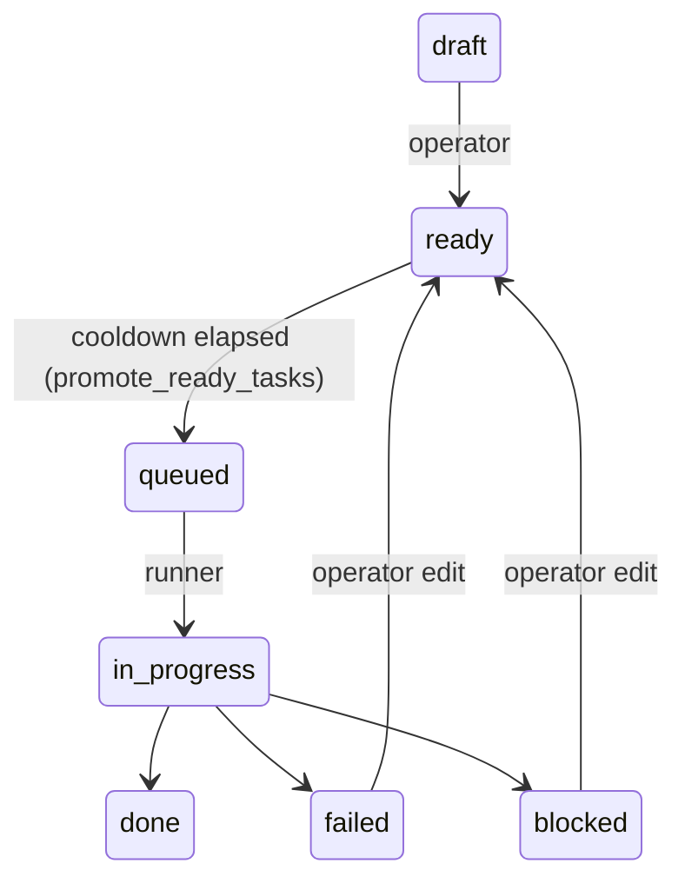

## 7. Board data model

### 7.1 Hierarchy

Project → Epic → Feature (owns a Git branch + worktree in the project repo; its board lives in the board repo) → Task (maps to commits on that project branch). All board files live in the board repo at `projects/{project}/board/`.

### 7.2 Frontmatter schemas

**Task** — `board/projects/{project}/board/features/active/{feature}/tasks/{id}-{slug}.md`

| Field | Values / type | Notes |
|---|---|---|
| `id` | zero-padded integer | unique within feature |
| `title` | string | |
| `status` | enum | see §7.3 |
| `pipeline` | string | **required**; pipeline name (resolved via §15.2 in [pipelines](15_pipelines.md)); missing or unresolvable → `status: blocked` |
| `epic` | string | parent epic id |
| `depends_on` | list of task ids | within-feature only; entries may be strings (`"001"`) or integers (`1`) — the parser normalises both to zero-padded strings at read time, guarding against YAML type coercion |
| `created_at` / `ready_at` | ISO 8601 | `ready_at` may be omitted by the operator; if absent when the runner first sees `status: ready`, the runner writes the current timestamp and commits — cooldown starts from that point |
| `attempts` | integer | total agent `query()` invocations across all pipeline steps for the current run; incremented once per call (retries count individually); reset to `0` by the runner when the task is promoted from `ready` → `queued` in `promote_ready_tasks()` |

Body: freeform operator-written prompt — describes the task, requirements, goals, and any relevant context pointers. `task_ingest` reads this body verbatim as the task artifact. The runner never modifies the task body — agent output and execution log are written to a companion `{id}-{slug}.result.md` file (see below), overwritten clean on each run. Templates for common task types live in `definitions/templates/tasks/`.

**Task result** — `board/projects/{project}/board/features/active/{feature}/tasks/{id}-{slug}.result.md`

Written by `update_board` at the end of each run; overwritten completely on re-runs; absent before the task's first run. All artifacts from the pipeline run are written in order — the full chain provides an audit trail of every step's output.

```markdown
## Pipeline Output

### [0] system
[task_ingest artifact body]

### [1] mapper
[mapper artifact body]

### [2] coder
[coder artifact body]

### [3] reviewer
[reviewer artifact body]

## Log
[2026-06-03 14:22] status: in_progress
[2026-06-03 14:35] status: done
```

**Feature** — `board/projects/{project}/board/features/active/{feature}/_feature.md`

| Field | Values / type |
|---|---|
| `id`, `title`, `description` | string |
| `status` | `open\|in_progress\|review\|merged\|closed` |
| `epic` | parent epic id |
| `branch` | project feature branch |
| `depends_on` | list of feature ids (must be `merged`/`closed` first) |
| `created_at` / `merged_at` | ISO 8601 |

**Epic** — `board/projects/{project}/board/epics/`

| Field | Values / type |
|---|---|
| `id`, `title`, `description` | string |
| `status` | `open\|closed` |
| `created_at` | ISO 8601 |

### 7.3 Task state machine



Operator-permitted transitions are made by editing the task file directly; runner-only transitions (→ `in_progress`) are made by the runner.

`blocked` = operator intervention required before the task can run again (agent returned `BLOCKED` confidence, or infrastructure failure in `branch_setup`/`agent_prepare`). `failed` = pipeline ran but could not complete (attempts exhausted, `stop` routing). Both fire a Telegram notification including the count of dependent tasks waiting. Both require an operator edit (fix + `status: ready`) to retry — dependent tasks remain `queued` and become eligible automatically once the prerequisite is `done`.

### 7.4 Feature lifecycle

`open → in_progress → review → merged → closed`

- `in_progress` — set by runner on first task start
- `review` — set by runner when all tasks → `done`; gate for operator review; dependent features remain blocked until the feature is approved
- `merged` — set by aurora when operator runs `aurora approve`; merge into `base_branch` succeeded; board archived, worktree removed
- `closed` — set by aurora when operator runs `aurora reject`, or by operator directly for features abandoned without merging; board archived, worktree removed
- **Rollback** (`aurora rollback`) returns the feature to `open` — branch reset to `base_branch` HEAD, all tasks reset to `ready`; no dedicated status value, the feature re-enters the normal queue

### 7.5 IDs and naming

Task ids: per-feature zero-padded incrementing integers. Filenames `{id}-{slug}.md`; renaming a title updates the slug, never the id. Feature/epic ids are kebab-case slugs unique within parent.

**Feature directory naming:** the feature directory name (`features/active/{feature}/`) is derived from the `id` field in `_feature.md` frontmatter on creation and must never change. The `id` field is the canonical identifier used in API paths and CLI commands. The runner validates on feature detection that the directory name matches the `id` field; a mismatch logs a warning and fires a Telegram notification.

*Proposed/staging task workflow (architect agent generating candidate tasks for operator review) is a planned feature — see [planned features](99_planned-features.md).*
