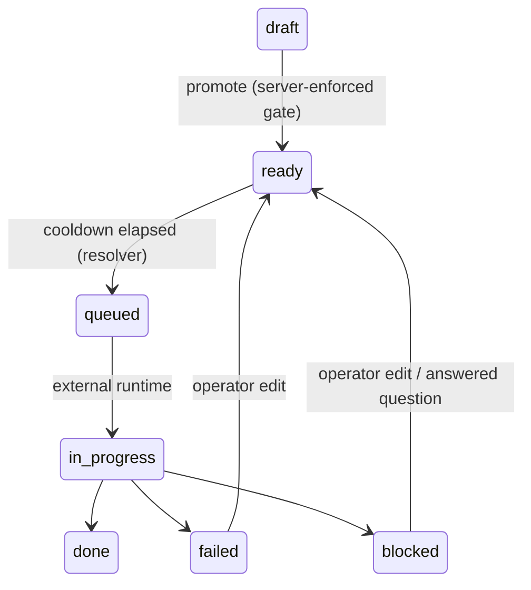

## 4. Board data model

### 4.1 Hierarchy

Project → Epic → Feature (owns a Git branch in the project repo; its board lives
in the board repo) → Task (maps to commits on that project branch). All board
files live in the board repo at `projects/{project}/board/`. Conversations are a
separate work-intake object at `projects/{project}/conversations/`.

### 4.2 Frontmatter schemas

**Task** — `projects/{project}/board/features/active/{feature}/tasks/{id}-{slug}.md`

| Field | Values / type | Notes |
|---|---|---|
| `id` | zero-padded integer | unique within feature |
| `title` | string | |
| `status` | enum | see §4.3 |
| `pipeline` | string | **required**; opaque routing metadata for an external runtime; missing/unresolvable → `status: blocked` |
| `epic` | string | parent epic id |
| `depends_on` | list of task ids | within-feature only; entries may be strings (`"001"`) or integers (`1`) — the parser normalises both to zero-padded strings at read time |
| `created_at` / `ready_at` | ISO 8601 | `ready_at` may be omitted; if absent when North first sees `status: ready`, North writes the current timestamp and commits — cooldown starts from that point |

Body: freeform operator-written prompt — describes the task, requirements, goals,
and any relevant context pointers. North never modifies the task body — results
are written to a companion `{id}-{slug}.result.md` file, overwritten clean on each
run.

**Task result** — `.../tasks/{id}-{slug}.result.md`

Written at the end of each run; overwritten completely on re-runs; absent before
the task's first run. Holds the external runtime's handoff note and any execution
log; it is an audit trail, never machine-parsed by North for routing.

**Feature** — `projects/{project}/board/features/active/{feature}/_feature.md`

| Field | Values / type |
|---|---|
| `id`, `title`, `description` | string |
| `status` | `draft\|open\|in_progress\|review\|merged\|closed` |
| `epic` | parent epic id |
| `branch` | project feature branch |
| `depends_on` | list of feature ids (must be `merged`/`closed` first) |
| `created_at` / `merged_at` | ISO 8601 |

**Epic** — `projects/{project}/board/epics/`

| Field | Values / type |
|---|---|
| `id`, `title`, `description` | string |
| `status` | `open\|closed` |
| `created_at` | ISO 8601 |

### 4.3 Task state machine

Created tasks always land `draft` — the human gate before execution. The promote
verb is the only way out of draft (the feature must be promoted first). Status
PATCHes are gated by a server-side transition table; illegal jumps (e.g.
`draft → done`) are rejected with `409`.

`blocked` = intervention required before the task can run again. `blocked_reason`
distinguishes `question` (waiting on a human — flips back to `ready` when an
`[answer]` comment is posted), `dependency`, and `infra` (auth/config failures
stamped by an external runtime). `failed` = the run could not complete. Both fire
a notification including the count of dependent tasks waiting; dependents remain
`queued` and become eligible automatically once the prerequisite is `done`.

### 4.4 Feature lifecycle

`draft → open → in_progress → review → merged → closed`

- `draft` — created features land here; `promote` moves them to `open`.
- `in_progress` — set when the first task starts.
- `review` — set when all tasks reach `done`; the gate for operator review;
  dependent features remain blocked until the feature is merged.
- `merged` — set when the feature branch is merged into `base_branch` by an
  external actor; board archived.
- `closed` — set when a feature is rejected or abandoned without merging; board
  archived.

**Refine rule:** creating a task on a feature in `review` reverts it to
`in_progress` in the same board commit; it returns to `review` when all tasks
complete again.

### 4.5 IDs and naming

Task ids: per-feature zero-padded incrementing integers. Filenames
`{id}-{slug}.md`; renaming a title updates the slug, never the id. Feature/epic
ids are kebab-case slugs unique within parent.

**Feature directory naming:** the directory name (`features/active/{feature}/`) is
derived from the `id` field in `_feature.md` on creation and must never change.
The `id` field is the canonical identifier used in API paths and CLI commands.
North validates on feature detection that the directory name matches the `id`
field; a mismatch logs a warning and fires a notification.

### 4.6 Split

`POST .../tasks/{id}/split` replaces an oversized task with children in one atomic
board commit: children inherit the parent's `depends_on` and carry `split_from`;
dependents of the parent are re-pointed to all children; the parent becomes
`superseded` (kept for audit). Tasks that are `done`/`in_progress`/`superseded`
cannot be split.
